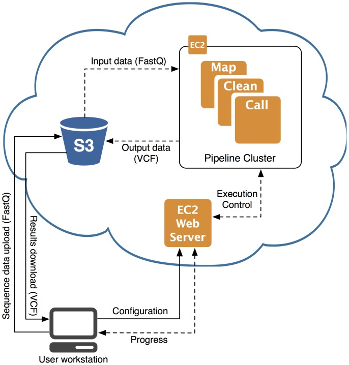

# AWS EC2 Instance With S3 Bucket

- In this example an EC2 instance will be and will be connected to a s3 bucket.
- Various different aws command will be carried out to create, read, update, and delete files in the s3 bucket.

## Running EC2 Instance
- Firstly we set up an ec2 instance with the following setting and dependencies.
##### AMI
`Ubuntu Server 16.04 LTS (HVM), SSD Volume Type`
##### Instance Type
`t2.micro`
##### Configure Instance 
```
Subnet:   subnet ............default1A
Auto-assign Public IP: Enable
```
##### Add Tags
``` 
Name: eng89_shervin
Description: Machine for running Application  
```
##### Configure Security Group 
- First Inbound protocol should be for the `SSH` at default port 22 and the localhost `IPV4`.
- ` HTTP` protocol also for access from local computer.

#### Dependencies
- SSH into EC2 instance and download the following dependencies